<div align="center">

<!-- PROJECT BANNER -->


<br/>

[](https://unity.com/)
[](https://docs.microsoft.com/en-us/dotnet/csharp/)
[](https://www.microsoft.com/windows)
[](.)
[](.)
[](.)
[](LICENSE)
[](.)

<br/>

> **🎮 Collect all 25 coins. Dodge the fire. Beat the clock.**
>
> *A fast-paced third-person 3D adventure where speed, precision, and survival collide.*

<br/>

[🎮 Play Now](#-installation-guide) · [📖 How To Play](#-how-to-play) · [🛠️ Architecture](#-system-architecture) · [🗺️ Roadmap](#-future-improvements)

<br/>

---

</div>

## 📋 Table of Contents

<details>
<summary>Click to expand the full table of contents</summary>

- [📋 Table of Contents](#-table-of-contents)
- [🎯 Project Overview](#-project-overview)
- [🎬 Gameplay Preview](#-gameplay-preview)
- [✨ Features](#-features)
- [🎮 Controls](#-controls)
- [📸 Screenshots](#-screenshots)
- [⚙️ Gameplay Mechanics](#️-gameplay-mechanics)
- [🏗️ System Architecture](#️-system-architecture)
- [📁 Folder Structure](#-folder-structure)
- [📜 Script Architecture](#-script-architecture)
- [🔊 Audio Architecture](#-audio-architecture)
- [🖥️ UI Architecture](#️-ui-architecture)
- [🏆 High Score System](#-high-score-system)
- [⚙️ Settings System](#️-settings-system)
- [💾 Data Persistence](#-data-persistence)
- [🔄 Project Workflow](#-project-workflow)
- [🧩 Challenges Solved](#-challenges-solved)
- [📚 Learning Outcomes](#-learning-outcomes)
- [🛠️ Technologies Used](#️-technologies-used)
- [⚡ Performance Considerations](#-performance-considerations)
- [🔨 Build Instructions](#-build-instructions)
- [📦 Installation Guide](#-installation-guide)
- [🕹️ How To Play](#️-how-to-play)
- [🗺️ Future Improvements](#️-future-improvements)
- [📊 Project Statistics](#-project-statistics)
- [👨‍💻 Developer](#-developer)
- [📄 License](#-license)
- [🙏 Acknowledgements](#-acknowledgements)

</details>

<br/>

---

## 🎯 Project Overview

<table>
<tr>
<td width="60%">

**Coin Rush** is a polished third-person 3D coin collection adventure built in Unity. The player navigates a dynamic environment, racing to collect all **25 coins** as fast as possible while skillfully avoiding **fire hazards** that deal damage and add penalty time.

The game blends **precision movement**, **health management**, and **speed optimization** into a tight, replayable loop — perfect for showcasing core game systems in a clean, professional codebase.

### 🧠 Design Philosophy

- **Simplicity of premise, depth of execution** — easy to understand, hard to master
- **Punishing but fair** — fire damage and penalty time create meaningful risk
- **Replayability** — top-5 leaderboard encourages players to beat their best time
- **Clean architecture** — each system is decoupled and independently maintainable

</td>
<td width="40%">

| Property | Value |
|---|---|
| 🎮 **Engine** | Unity |
| 💻 **Language** | C# |
| 🪟 **Platform** | Windows PC |
| 🎭 **Genre** | 3D Adventure |
| 📦 **Type** | Portfolio Project |
| 🏷️ **Version** | v1.0 |
| ✅ **Status** | Completed |
| 🎯 **Coins** | 25 |
| ❤️ **Starting HP** | 100 |
| 🔥 **Fire Damage** | 20 HP + 2s penalty |

</td>
</tr>
</table>

<br/>

---

## 🎬 Gameplay Preview

<div align="center">

```
╔══════════════════════════════════════════════════════════════╗
║                     GAMEPLAY LOOP                            ║
║                                                              ║
║   🏃 Explore ──► 🪙 Collect ──► 🔥 Avoid ──► ⏱️ Fastest   ║
║       └──────────────────────────────────────►  Time!       ║
╚══════════════════════════════════════════════════════════════╝
```

</div>

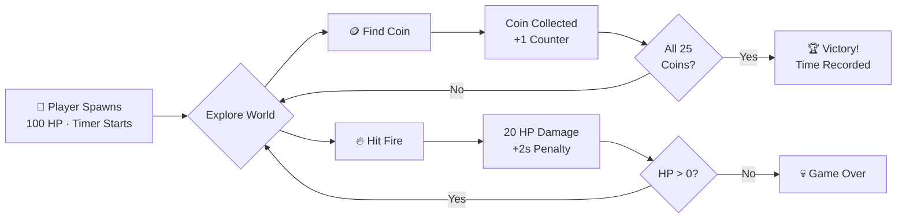
```mermaid
flowchart LR
    A[🏃 Player Spawns\n100 HP · Timer Starts] --> B{Explore World}
    B --> C[🪙 Find Coin]
    B --> D[🔥 Hit Fire]
    C --> E[Coin Collected\n+1 Counter]
    D --> F[20 HP Damage\n+2s Penalty]
    E --> G{All 25\nCoins?}
    F --> H{HP > 0?}
    G -- Yes --> I[🏆 Victory!\nTime Recorded]
    G -- No --> B
    H -- Yes --> B
    H -- No --> J[💀 Game Over]
```

<br/>

---

## ✨ Features

<details>
<summary>🎮 <b>Gameplay Systems</b></summary>

<br/>

| System | Description |
|---|---|
| 🕹️ **Third-Person Controller** | Smooth, responsive WASD movement using Unity's CharacterController |
| 📷 **Camera System** | Mouse-driven third-person camera with sensitivity settings |
| 🪙 **Coin Collection** | 25 collectible coins with visual feedback and audio cues |
| ❤️ **Health System** | 100 HP with visual health bar; depletes on fire contact |
| 🔥 **Fire Hazard System** | Dynamic fire obstacles dealing 20 HP + 2s time penalty |
| ⏱️ **Timer System** | Live countdown tracker with penalty accumulation |
| 🏆 **Win Condition** | Triggered on collecting all 25 coins |
| 💀 **Game Over Condition** | Triggered when HP reaches zero |

</details>

<details>
<summary>🔊 <b>Audio Systems</b></summary>

<br/>

| Sound | Trigger |
|---|---|
| 🎵 Main Menu Music | On main menu load |
| 🚶 Idle Sound | Player standing still |
| 👟 Walking Sound | Player moving |
| 🪙 Coin Collect Sound | On coin pickup |
| 💥 Hurt Sound | On fire collision |
| 🏆 Win Sound | On victory |
| 💀 Game Over Sound | On HP = 0 |
| 🖱️ Button Click Sound | UI button interactions |

</details>

<details>
<summary>🖥️ <b>UI Systems</b></summary>

<br/>

| Screen / Panel | Description |
|---|---|
| 🏠 Main Menu | Game entry point with navigation |
| ❓ How To Play | Instructions panel |
| 🏆 Best Scores | Top 5 leaderboard panel |
| ⚙️ Settings Panel | Volume and sensitivity controls |
| ⏸️ Pause Menu | In-game pause and resume |
| 🎉 Win Screen | Victory display with time |
| 💀 Game Over Screen | Defeat display with retry option |
| ❤️ Health Bar | Real-time HP display |
| 🪙 Coin Counter | Collected / Total display |
| ⏱️ Timer Display | Live elapsed time |

</details>

<details>
<summary>⚙️ <b>Settings & Persistence</b></summary>

<br/>

| Setting | Type | Persistent |
|---|---|---|
| 🎵 Menu Music Volume | Slider (0–1) | ✅ Yes |
| 🔊 Game Sound Volume | Slider (0–1) | ✅ Yes |
| 🖱️ Mouse Sensitivity | Slider | ✅ Yes |
| 🏆 Top 5 High Scores | Score Records | ✅ Yes |

</details>

<br/>

---

## 🎮 Controls

<div align="center">

| Input | Action |
|:---:|:---|
| `W` | Move Forward |
| `A` | Move Left |
| `S` | Move Backward |
| `D` | Move Right |
| `Mouse` | Camera Control |
| `ESC` | Pause / Resume |

</div>

<br/>

---

## 📸 Screenshots

### 🏠 Main Menu

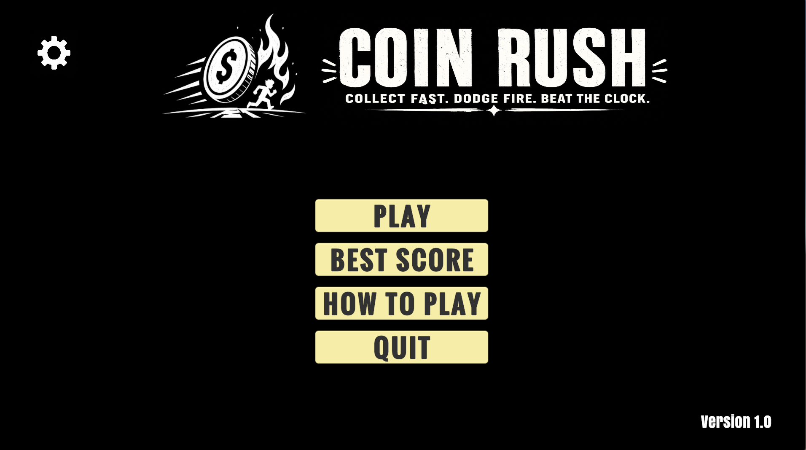

### ❓ How To Play

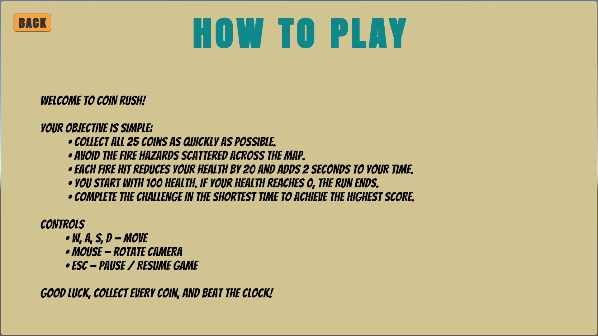

### 🏆 High Scores

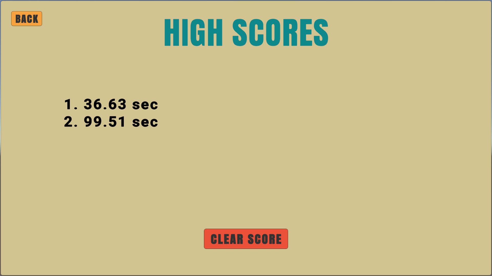

### 🎮 Gameplay - Exploration

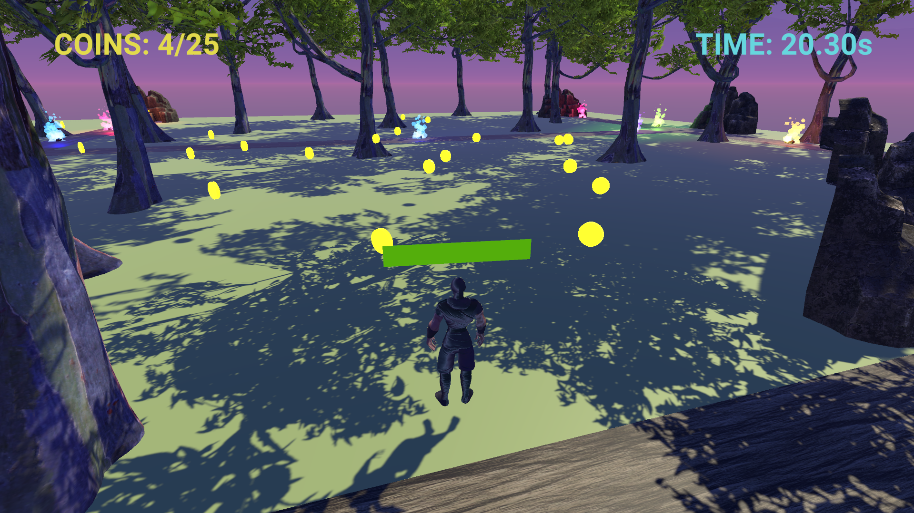

### 🎮 Gameplay - Coin Collection & Hazards

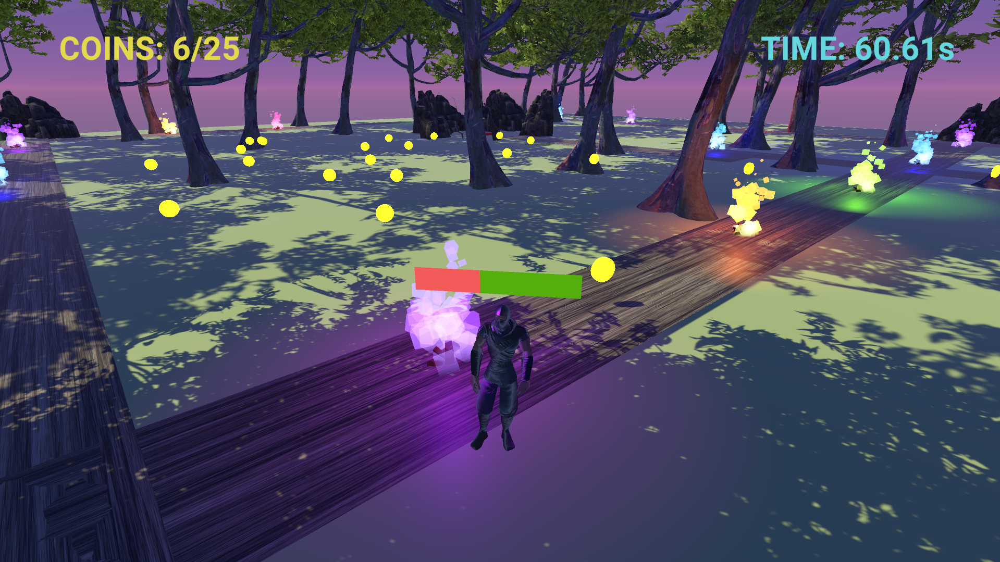

### ⚙️ Settings

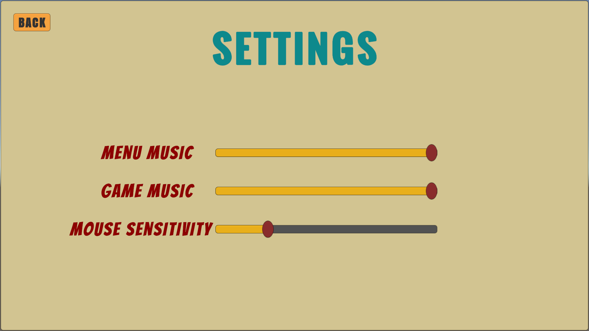

### 🏆 Win Screen

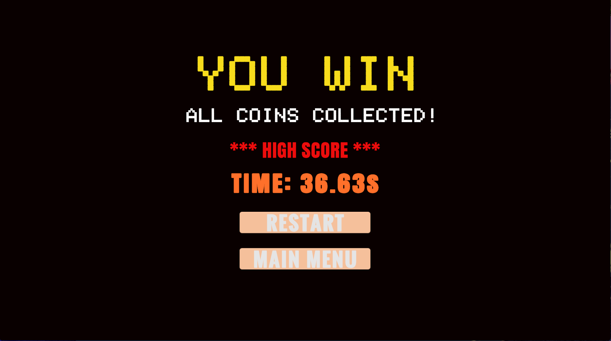

### 💀 Game Over Screen

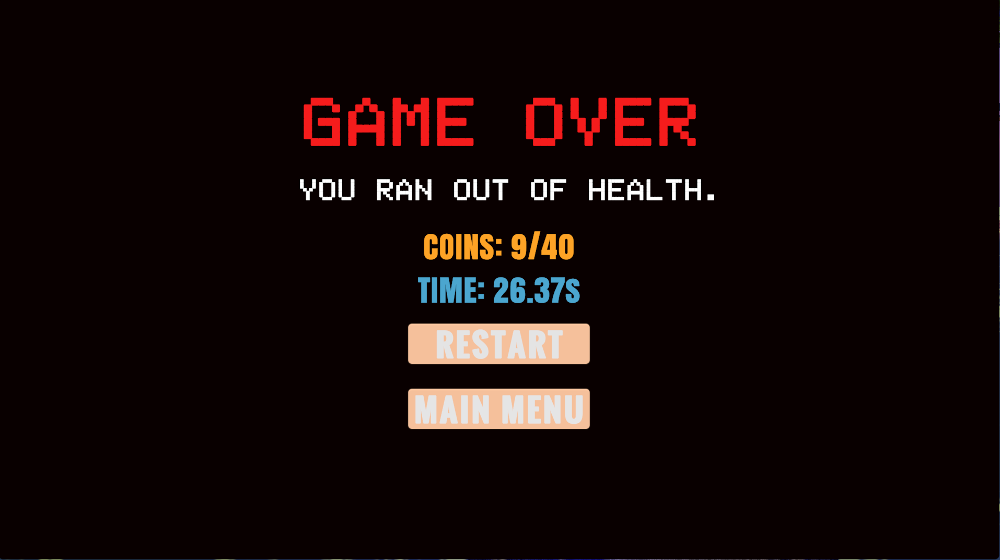

<br/>


---

## 🎥 Gameplay Video

<div align="center">

<a href="https://drive.google.com/file/d/1agRdtoqqSQSEjQw67j8poEnI1FEJdpnH/view?usp=sharing">


</a>

### ▶️ Watch Full Gameplay

Click the thumbnail above to view the gameplay video.

</div>

<br/>

---

## ⚙️ Gameplay Mechanics

### 🔥 Fire Hazard System

When the player collides with a fire hazard:

```
Fire Collision Detected
        │
        ├──► -20 Health Points
        │
        └──► +2 Seconds added to Timer (Penalty)
```

> ⚠️ **Design Intent:** The double punishment (HP loss + time penalty) creates a meaningful trade-off. Players must decide whether rushing through a fire to reach a coin is worth the combined cost.

### 🪙 Coin Collection System

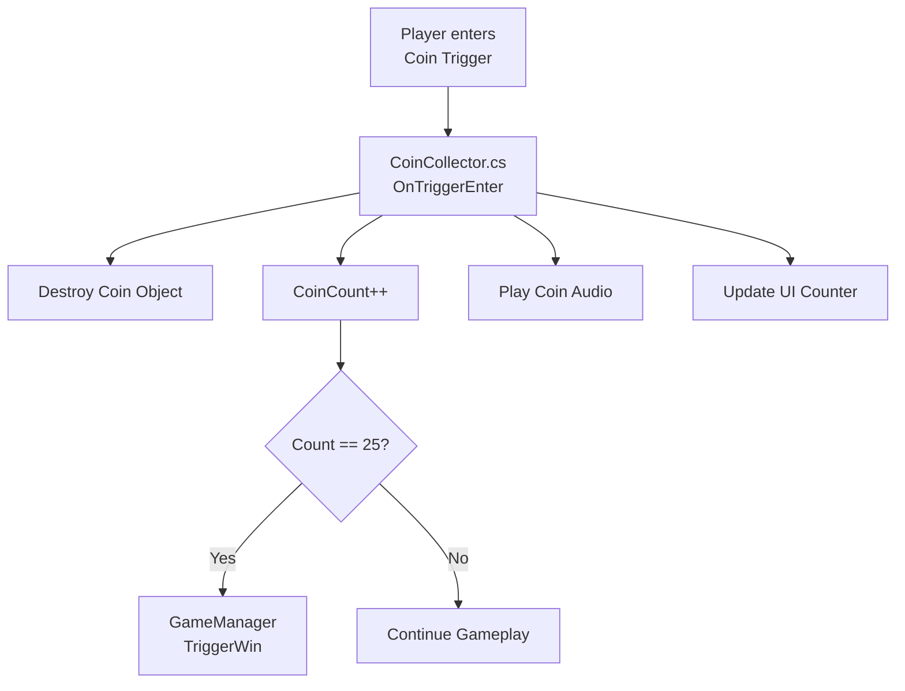
```mermaid
flowchart TD
    A[Player enters\nCoin Trigger] --> B[CoinCollector.cs\nOnTriggerEnter]
    B --> C[Destroy Coin Object]
    B --> D[CoinCount++]
    B --> E[Play Coin Audio]
    B --> F[Update UI Counter]
    D --> G{Count == 25?}
    G -- Yes --> H[GameManager\nTriggerWin]
    G -- No --> I[Continue Gameplay]
```

### ❤️ Health System

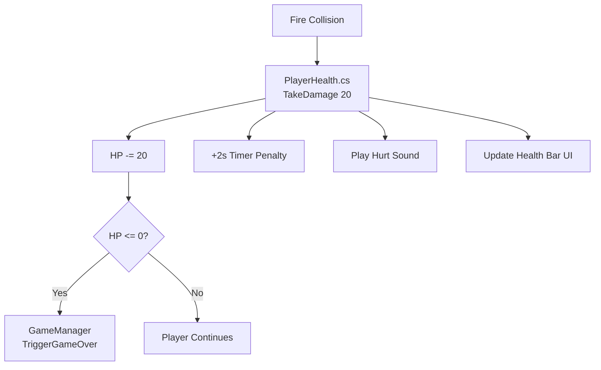
```mermaid
flowchart TD
    A[Fire Collision] --> B[PlayerHealth.cs\nTakeDamage 20]
    B --> C[HP -= 20]
    B --> D[+2s Timer Penalty]
    B --> E[Play Hurt Sound]
    B --> F[Update Health Bar UI]
    C --> G{HP <= 0?}
    G -- Yes --> H[GameManager\nTriggerGameOver]
    G -- No --> I[Player Continues]
```

### ⏱️ Timer System

The timer tracks elapsed time in real-time and accumulates 2-second penalties for each fire collision. On victory, the final time is submitted to the High Score system.

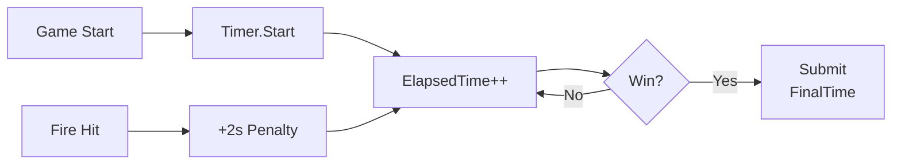
```mermaid
flowchart LR
    A[Game Start] --> B[Timer.Start]
    B --> C[ElapsedTime++]
    D[Fire Hit] --> E[+2s Penalty]
    E --> C
    C --> F{Win?}
    F -- Yes --> G[Submit\nFinalTime]
    F -- No --> C
```

<br/>

---

## 🏗️ System Architecture

### 🗺️ Overall Project Architecture

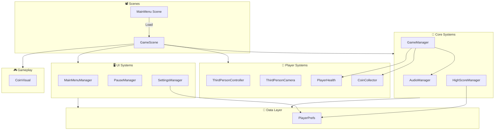
```mermaid
graph TB
    subgraph SCENES["📽️ Scenes"]
        MM[MainMenu Scene]
        GS[GameScene]
    end

    subgraph CORE["🔧 Core Systems"]
        AM[AudioManager]
        GM[GameManager]
        HSM[HighScoreManager]
    end

    subgraph PLAYER["🧍 Player Systems"]
        TPC[ThirdPersonController]
        CAM[ThirdPersonCamera]
        PH[PlayerHealth]
        CC[CoinCollector]
    end

    subgraph UI_SYS["🖥️ UI Systems"]
        MN[MainMenuManager]
        PM[PauseManager]
        SM[SettingsManager]
    end

    subgraph GAMEPLAY["🎮 Gameplay"]
        CV[CoinVisual]
    end

    subgraph PERSISTENCE["💾 Data Layer"]
        PP[PlayerPrefs]
    end

    MM -->|Load| GS
    GS --> CORE
    GS --> PLAYER
    GS --> UI_SYS
    GS --> GAMEPLAY
    CORE --> PERSISTENCE
    UI_SYS --> PERSISTENCE
    GM --> PH
    GM --> CC
    GM --> AM
    HSM --> PP
    SM --> PP
```

### 🎮 Game State Flow

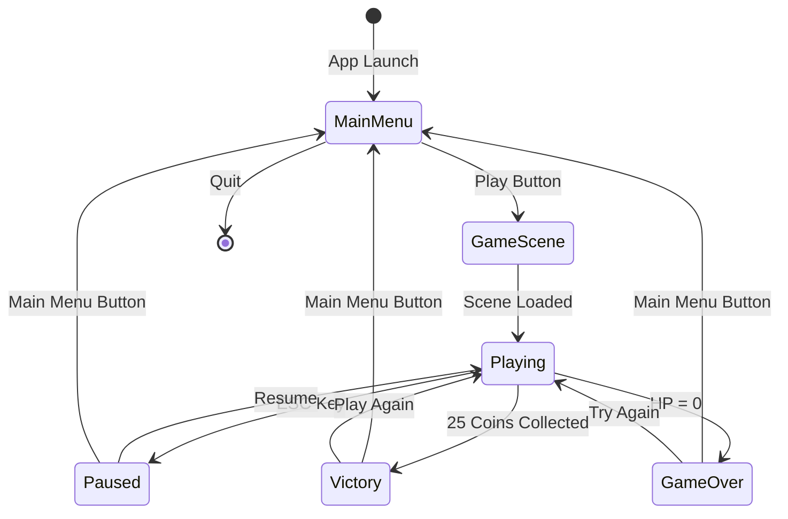
```mermaid
stateDiagram-v2
    [*] --> MainMenu : App Launch
    MainMenu --> GameScene : Play Button
    GameScene --> Playing : Scene Loaded
    Playing --> Paused : ESC Key
    Paused --> Playing : Resume
    Paused --> MainMenu : Main Menu Button
    Playing --> Victory : 25 Coins Collected
    Playing --> GameOver : HP = 0
    Victory --> MainMenu : Main Menu Button
    Victory --> Playing : Play Again
    GameOver --> MainMenu : Main Menu Button
    GameOver --> Playing : Try Again
    MainMenu --> [*] : Quit
```

### 🔄 Scene Transition Flow

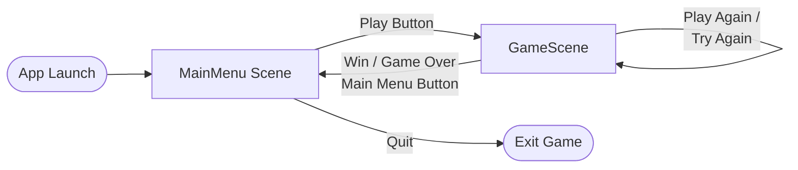
```mermaid
flowchart LR
    A([App Launch]) --> B[MainMenu Scene]
    B -->|Play Button| C[GameScene]
    C -->|Win / Game Over\nMain Menu Button| B
    C -->|Play Again /\nTry Again| C
    B -->|Quit| D([Exit Game])
```

<br/>

---

## 📁 Folder Structure

```
📦 Coin-Rush
┣ 📂 Assets
┃ ┣ 📂 Audio
┃ ┃ ┣ 🎵 MainMenu
┃ ┃ ┣ 🔊 Walking
┃ ┃ ┣ 🔊 Coin
┃ ┃ ┣ 🔊 Hurt
┃ ┃ ┣ 🔊 Win
┃ ┃ ┣ 🔊 GameOver
┃ ┃ ┗ 🔊 ButtonClick
┃ ┃
┃ ┣ 📂 Character
┃ ┃ ┣ 🎮 Character Model
┃ ┃ ┗ 🎮 Character Assets
┃ ┃
┃ ┣ 📂 Environment
┃ ┃ ┣ 🌲 Trees
┃ ┃ ┣ 🪨 Rocks
┃ ┃ ┣ 🔥 Fire
┃ ┃ ┣ 🛣️ RoadPrints
┃ ┃ ┗ 🌌 Skybox
┃ ┃
┃ ┣ 📂 Materials
┃ ┃
┃ ┣ 📂 Prefabs
┃ ┃
┃ ┣ 📂 Scenes
┃ ┃ ┣ 🎬 MainMenu.unity
┃ ┃ ┗ 🎬 GAME Scene.unity
┃ ┃
┃ ┣ 📂 Scripts
┃ ┃ ┣ 📂 AudioSystem
┃ ┃ ┃ ┣ 📄 AudioManager.cs
┃ ┃ ┃ ┗ 📄 SettingsManager.cs
┃ ┃ ┃
┃ ┃ ┣ 📂 Character
┃ ┃ ┃ ┣ 📄 ThirdPersonCamera.cs
┃ ┃ ┃ ┗ 📄 ThirdPersonController.cs
┃ ┃ ┃
┃ ┃ ┣ 📂 Core Game
┃ ┃ ┃ ┣ 📄 CoinCollector.cs
┃ ┃ ┃ ┣ 📄 CoinVisual.cs
┃ ┃ ┃ ┣ 📄 GameManager.cs
┃ ┃ ┃ ┗ 📄 PlayerHealth.cs
┃ ┃ ┃
┃ ┃ ┗ 📂 Panel System
┃ ┃ ┃ ┣ 📄 HighScoreManager.cs
┃ ┃ ┃ ┣ 📄 MainMenuManager.cs
┃ ┃ ┃ ┗ 📄 PauseManager.cs
┃ ┃
┃ ┗ 📂 TextMesh Pro
┃
┣ 📂 Screenshots
┃ ┣ 📸 MainMenu.png
┃ ┣ 📸 Settings.png
┃ ┣ 📸 HowToPlay.png
┃ ┣ 📸 HighScore.png
┃ ┣ 📸 GameScene-1.png
┃ ┣ 📸 GameScene-2.png
┃ ┣ 📸 Win.png
┃ ┗ 📸 GameOver.png
┃
┣ 📄 README.md
┣ 📄 LICENSE
┗ 📄 .gitignore
```

<br/>

---

## 📜 Script Architecture

### 📊 Script Dependency Map

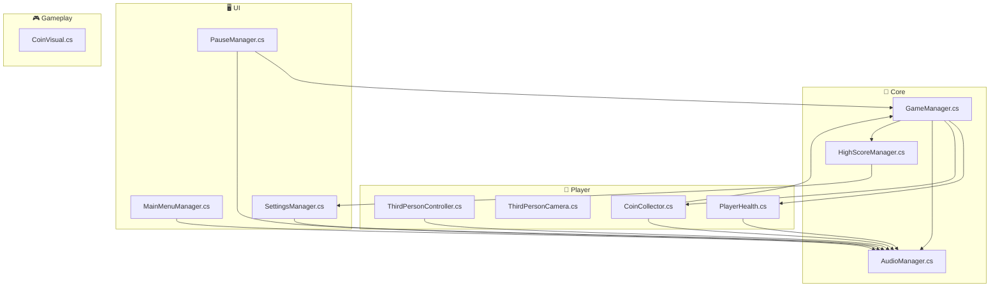
```mermaid
graph TD
    subgraph CORE["🔧 Core"]
        GM[GameManager.cs]
        AM[AudioManager.cs]
        HSM[HighScoreManager.cs]
    end

    subgraph PLAYER["🧍 Player"]
        TPC[ThirdPersonController.cs]
        CAM[ThirdPersonCamera.cs]
        PH[PlayerHealth.cs]
        CC[CoinCollector.cs]
    end

    subgraph UI["🖥️ UI"]
        MN[MainMenuManager.cs]
        PM[PauseManager.cs]
        SM[SettingsManager.cs]
    end

    subgraph GAMEPLAY["🎮 Gameplay"]
        CV[CoinVisual.cs]
    end

    GM --> PH
    GM --> CC
    GM --> AM
    GM --> HSM
    PH --> AM
    CC --> AM
    CC --> GM
    PM --> GM
    PM --> AM
    MN --> AM
    SM --> AM
    HSM --> SM
    TPC --> AM
```

### 📋 Script Reference Table

<details>
<summary><b>🔧 Core Scripts</b></summary>

<br/>

| Script | Responsibility | Key Methods |
|---|---|---|
| `GameManager.cs` | Central game state controller — manages win/lose, timer, pause | `TriggerWin()`, `TriggerGameOver()`, `PauseGame()`, `ResumeGame()` |
| `AudioManager.cs` | Singleton audio controller for all SFX and music | `PlayCoinSound()`, `PlayHurtSound()`, `PlayWinSound()`, `SetVolume()` |
| `HighScoreManager.cs` | Top-5 score storage, retrieval, and sorting | `SubmitScore()`, `GetScores()`, `SaveScores()`, `LoadScores()` |

</details>

<details>
<summary><b>🧍 Player Scripts</b></summary>

<br/>

| Script | Responsibility | Key Methods |
|---|---|---|
| `ThirdPersonController.cs` | WASD movement via CharacterController, animation states | `Move()`, `HandleInput()`, `ApplyGravity()` |
| `ThirdPersonCamera.cs` | Mouse-driven third-person camera, smooth follow, pitch limits, adjustable sensitivity | `RotateCamera()`, `UpdatePosition()` |
| `PlayerHealth.cs` | HP management, fire damage, death detection | `TakeDamage()`, `Die()`, `UpdateHealthBar()` |
| `CoinCollector.cs` | Trigger detection, coin counting, win check | `OnTriggerEnter()`, `CollectCoin()`, `CheckWinCondition()` |

</details>

<details>
<summary><b>🖥️ UI Scripts</b></summary>

<br/>

| Script | Responsibility | Key Methods |
|---|---|---|
| `MainMenuManager.cs` | Main menu panel navigation and button events | `OpenHowToPlay()`, `OpenBestScores()`, `OpenSettings()`, `StartGame()` |
| `PauseManager.cs` | ESC-key pause toggle, pause menu display | `TogglePause()`, `GoToMainMenu()` |
| `SettingsManager.cs` | Slider UI binding, saving/loading settings | `SetMusicVolume()`, `SetSFXVolume()`, `SetSensitivity()` |

</details>

<details>
<summary><b>🎮 Gameplay Scripts</b></summary>

<br/>

| Script | Responsibility | Key Methods |
|---|---|---|
| `CoinVisual.cs` | Coin rotation/bobbing animation | `Update()` — handles transform animation |

</details>

<br/>

---

## 🔊 Audio Architecture

### Audio System Flow

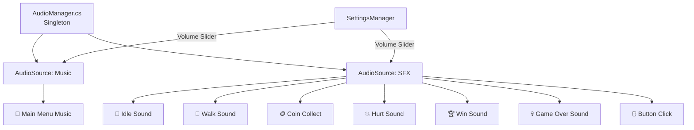
```mermaid
flowchart TD
    AM[AudioManager.cs\nSingleton] --> A1[AudioSource: Music]
    AM --> A2[AudioSource: SFX]

    A1 --> S1[🎵 Main Menu Music]

    A2 --> S2[🚶 Idle Sound]
    A2 --> S3[👟 Walk Sound]
    A2 --> S4[🪙 Coin Collect]
    A2 --> S5[💥 Hurt Sound]
    A2 --> S6[🏆 Win Sound]
    A2 --> S7[💀 Game Over Sound]
    A2 --> S8[🖱️ Button Click]

    SM[SettingsManager] -->|Volume Slider| A1
    SM -->|Volume Slider| A2
```

### 🔊 Audio Trigger Map

| Event | Audio Clip | Channel |
|---|---|---|
| Main menu loaded | Main Menu Music | 🎵 Music |
| Player idle | Idle Loop | 🔊 SFX |
| Player walking | Walk Loop | 🔊 SFX |
| Coin collected | Coin Ding | 🔊 SFX |
| Fire collision | Hurt grunt | 🔊 SFX |
| 25 coins collected | Victory fanfare | 🔊 SFX |
| HP reaches 0 | Game over sting | 🔊 SFX |
| Any UI button | Click tick | 🔊 SFX |

<br/>

---

## 🖥️ UI Architecture

### UI Navigation Flow

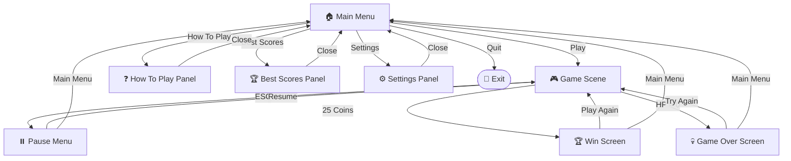
```mermaid
flowchart TD
    MM[🏠 Main Menu]

    MM -->|Play| GS[🎮 Game Scene]
    MM -->|How To Play| HTP[❓ How To Play Panel]
    MM -->|Best Scores| BS[🏆 Best Scores Panel]
    MM -->|Settings| SP[⚙️ Settings Panel]
    MM -->|Quit| EXIT([🚪 Exit])

    HTP -->|Close| MM
    BS -->|Close| MM
    SP -->|Close| MM

    GS -->|ESC| PM[⏸️ Pause Menu]
    PM -->|Resume| GS
    PM -->|Main Menu| MM

    GS -->|25 Coins| WS[🏆 Win Screen]
    GS -->|HP = 0| GO[💀 Game Over Screen]

    WS -->|Play Again| GS
    WS -->|Main Menu| MM
    GO -->|Try Again| GS
    GO -->|Main Menu| MM
```

### 📊 HUD Elements

| HUD Element | Script | Update Trigger |
|---|---|---|
| ❤️ Health Bar | `PlayerHealth.cs` | On `TakeDamage()` |
| 🪙 Coin Counter | `CoinCollector.cs` | On `CollectCoin()` |
| ⏱️ Timer Display | `GameManager.cs` | Every frame (`Update()`) |

<br/>

---

## 🏆 High Score System

### Score Submission Flow

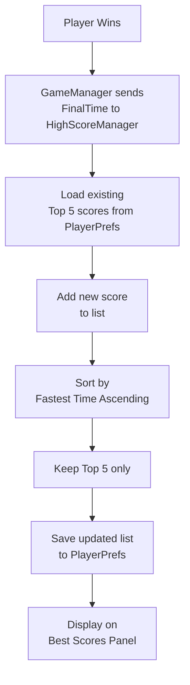
```mermaid
flowchart TD
    A[Player Wins] --> B[GameManager sends\nFinalTime to HighScoreManager]
    B --> C[Load existing\nTop 5 scores from PlayerPrefs]
    C --> D[Add new score\nto list]
    D --> E[Sort by\nFastest Time Ascending]
    E --> F[Keep Top 5 only]
    F --> G[Save updated list\nto PlayerPrefs]
    G --> H[Display on\nBest Scores Panel]
```

### 🏆 Score Storage — PlayerPrefs Keys

Scores are stored directly as individual float values in `PlayerPrefs`. The `HighScoreManager` reads, inserts, sorts, and re-saves them on every win.

```
PlayerPrefs Keys:
  Score_0   →  float  (1st place time, fastest)
  Score_1   →  float  (2nd place time)
  Score_2   →  float  (3rd place time)
  Score_3   →  float  (4th place time)
  Score_4   →  float  (5th place time)
  ScoreCount →  int   (number of scores recorded, max 5)
```

### Score Board Logic

Scores are displayed in ascending order (fastest first). All entries are shown consistently with no special visual distinction between ranks.

| Rank | Condition |
|:---:|---|
| 🥇 #1 | Fastest recorded time |
| 🥈 #2 | Second fastest |
| 🥉 #3 | Third fastest |
| 4️⃣ #4 | Fourth fastest |
| 5️⃣ #5 | Fifth fastest |

<br/>

---

## ⚙️ Settings System

### Settings Data Flow

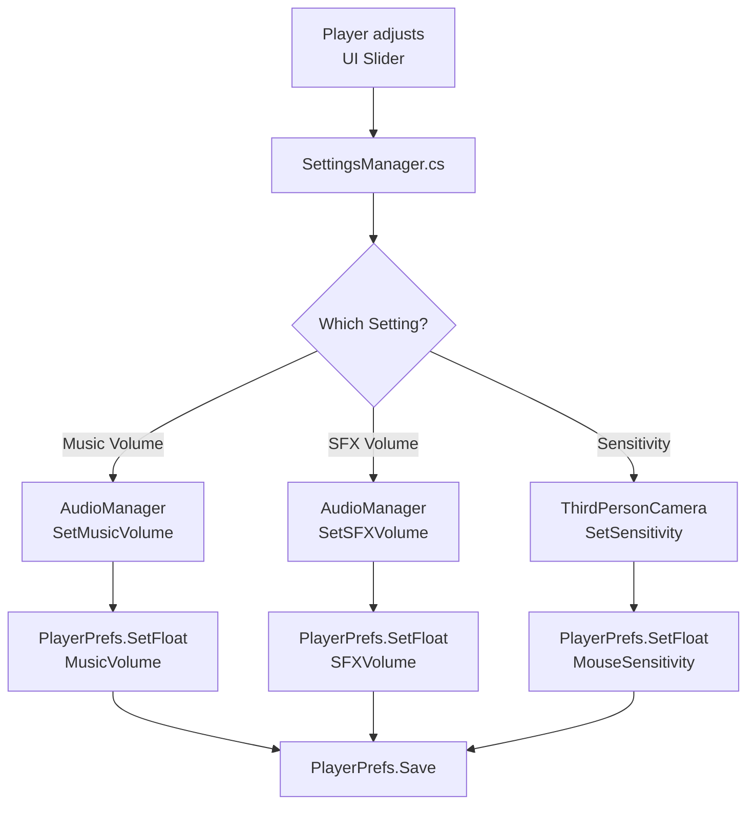
```mermaid
flowchart TD
    A[Player adjusts\nUI Slider] --> B[SettingsManager.cs]
    B --> C{Which Setting?}

    C -->|Music Volume| D[AudioManager\nSetMusicVolume]
    C -->|SFX Volume| E[AudioManager\nSetSFXVolume]
    C -->|Sensitivity| F[ThirdPersonCamera\nSetSensitivity]

    D --> G[PlayerPrefs.SetFloat\nMusicVolume]
    E --> H[PlayerPrefs.SetFloat\nSFXVolume]
    F --> I[PlayerPrefs.SetFloat\nMouseSensitivity]

    G --> J[PlayerPrefs.Save]
    H --> J
    I --> J
```

### ⚙️ Settings Reference

| Setting Key | Type | Default | Range |
|---|---|---|---|
| `MusicVolume` | Float | 0.75 | 0.0 – 1.0 |
| `SFXVolume` | Float | 1.0 | 0.0 – 1.0 |
| `MouseSensitivity` | Float | 2.0 | 0.5 – 10.0 |

<br/>

---

## 💾 Data Persistence

### Persistence Architecture

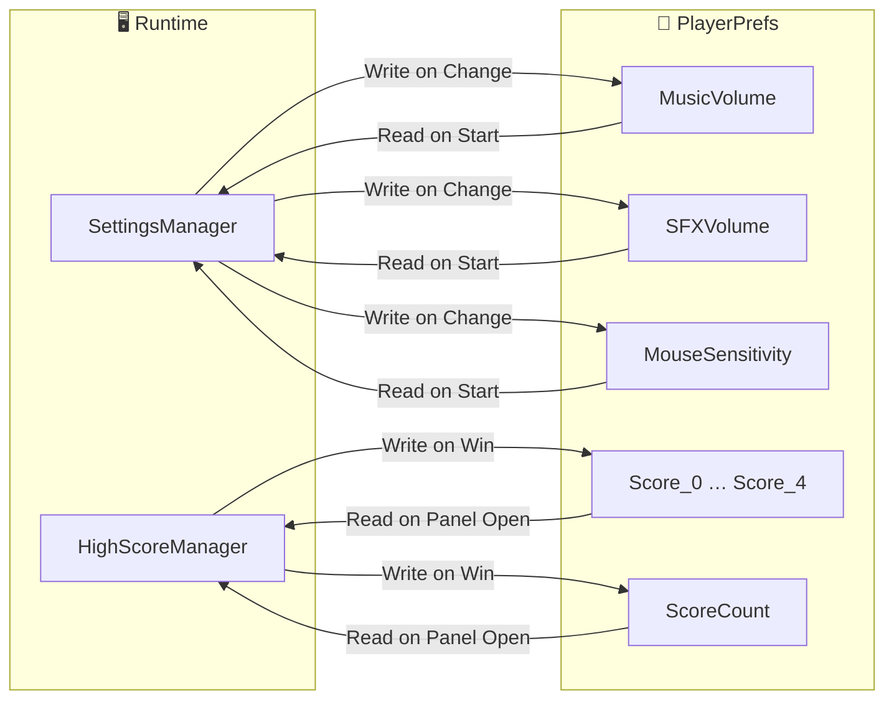
```mermaid
flowchart LR
    subgraph RUNTIME["🖥️ Runtime"]
        SM[SettingsManager]
        HSM[HighScoreManager]
    end

    subgraph PLAYERPREFS["💾 PlayerPrefs"]
        K1[MusicVolume]
        K2[SFXVolume]
        K3[MouseSensitivity]
        K4[Score_0 … Score_4]
        K5[ScoreCount]
    end

    SM -->|Write on Change| K1
    SM -->|Write on Change| K2
    SM -->|Write on Change| K3
    HSM -->|Write on Win| K4
    HSM -->|Write on Win| K5

    K1 -->|Read on Start| SM
    K2 -->|Read on Start| SM
    K3 -->|Read on Start| SM
    K4 -->|Read on Panel Open| HSM
    K5 -->|Read on Panel Open| HSM
```

### 💾 PlayerPrefs Key Registry

| Key | Data Type | Manager | When Written | When Read |
|---|---|---|---|---|
| `MusicVolume` | Float | SettingsManager | Slider change | Scene load |
| `SFXVolume` | Float | SettingsManager | Slider change | Scene load |
| `MouseSensitivity` | Float | SettingsManager | Slider change | Scene load |
| `Score_0` … `Score_4` | Float | HighScoreManager | On win | Scores panel open |
| `ScoreCount` | Int | HighScoreManager | On win | Scores panel open |

> **Note:** `PlayerPrefs` stores data in the Windows Registry on PC. Data persists across game sessions until the player clears it or uninstalls the game.

<br/>

---

## 🔄 Project Workflow

### Development Phases

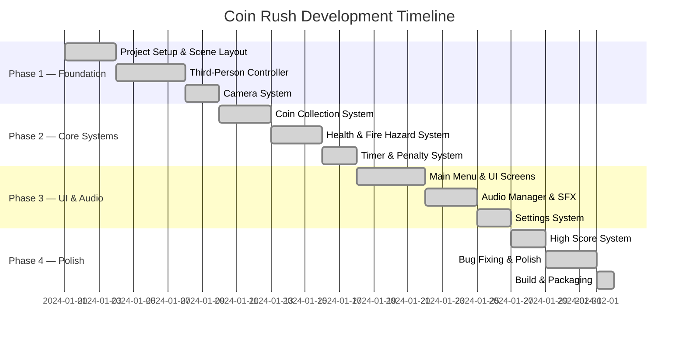
```mermaid
gantt
    title Coin Rush Development Timeline
    dateFormat  YYYY-MM-DD
    section Phase 1 — Foundation
    Project Setup & Scene Layout     :done, p1, 2024-01-01, 3d
    Third-Person Controller          :done, p2, after p1, 4d
    Camera System                    :done, p3, after p2, 2d
    section Phase 2 — Core Systems
    Coin Collection System           :done, p4, after p3, 3d
    Health & Fire Hazard System      :done, p5, after p4, 3d
    Timer & Penalty System           :done, p6, after p5, 2d
    section Phase 3 — UI & Audio
    Main Menu & UI Screens           :done, p7, after p6, 4d
    Audio Manager & SFX              :done, p8, after p7, 3d
    Settings System                  :done, p9, after p8, 2d
    section Phase 4 — Polish
    High Score System                :done, p10, after p9, 2d
    Bug Fixing & Polish              :done, p11, after p10, 3d
    Build & Packaging                :done, p12, after p11, 1d
```

### Player Interaction Flow

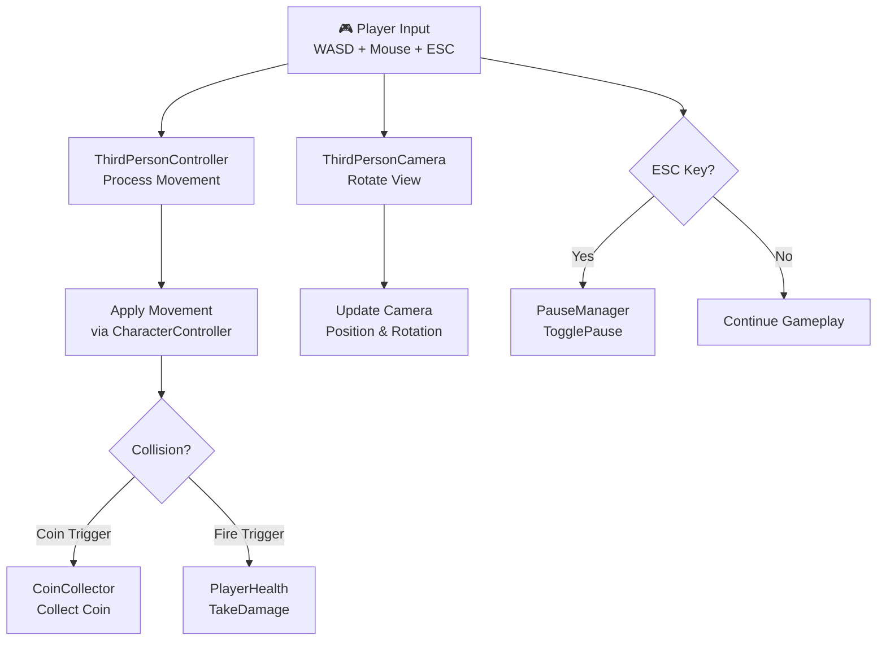
```mermaid
flowchart TD
    INPUT[🎮 Player Input\nWASD + Mouse + ESC]
    INPUT --> TPC[ThirdPersonController\nProcess Movement]
    INPUT --> CAM[ThirdPersonCamera\nRotate View]
    INPUT --> ESC{ESC Key?}

    TPC --> MOVE[Apply Movement\nvia CharacterController]
    CAM --> VIEW[Update Camera\nPosition & Rotation]
    ESC -- Yes --> PM[PauseManager\nTogglePause]
    ESC -- No --> CONTINUE[Continue Gameplay]

    MOVE --> COLL{Collision?}
    COLL -->|Coin Trigger| CC[CoinCollector\nCollect Coin]
    COLL -->|Fire Trigger| PH[PlayerHealth\nTakeDamage]
```

<br/>

---

## 🧩 Challenges Solved

<details>
<summary>🔥 <b>Challenge 1 — Decoupled Audio Management</b></summary>

**Problem:** Multiple scripts needed to trigger audio, risking tight coupling and duplicate AudioSource references.

**Solution:** Implemented `AudioManager.cs` as a **Singleton** with a `DontDestroyOnLoad` pattern. Any script can call `AudioManager.Instance.PlayCoinSound()` without holding a direct reference to an AudioSource, keeping all audio logic centralized.

</details>

<details>
<summary>⏱️ <b>Challenge 2 — Accurate Penalty Timer</b></summary>

**Problem:** Adding a 2-second time penalty on each fire collision while keeping the timer accurate and the overall time tracking clean.

**Solution:** The `GameManager` owns the timer as a running float incremented each frame via `Time.deltaTime`. On fire contact, `PlayerHealth` calls into `GameManager` to add the 2-second penalty directly to the accumulated time, keeping all timer state centralized and consistent.

</details>

<details>
<summary>🏆 <b>Challenge 3 — Persistent Top-5 Score Sorting</b></summary>

**Problem:** Storing and maintaining a sorted leaderboard across game sessions using only `PlayerPrefs`, which supports primitive types only.

**Solution:** Each score is saved as an individual `float` under indexed keys (`Score_0` through `Score_4`), with a `ScoreCount` int tracking how many entries exist. On every win, `HighScoreManager` reads all saved scores into a list, inserts the new time, sorts ascending (fastest first), trims to 5 entries, and writes them back. Lightweight, dependency-free, and fully persistent.

</details>

<details>
<summary>📷 <b>Challenge 4 — Smooth Third-Person Camera</b></summary>

**Problem:** Camera jitter and one-frame position lag during rapid player turns, especially at pitch limits.

**Solution:** Camera position and rotation are updated in `LateUpdate()`, which always runs after `Update()`, eliminating position lag. Pitch clamping prevents the camera from flipping at extreme vertical angles, and sensitivity is configurable via the Settings system.

</details>

<details>
<summary>⚙️ <b>Challenge 5 — Settings Persistence Across Scenes</b></summary>

**Problem:** Settings needed to survive scene transitions (menu → game → menu).

**Solution:** `SettingsManager` reads from `PlayerPrefs` on `Awake()` in every scene, ensuring sliders are always initialized to saved values immediately on load — regardless of which scene is active.

</details>

<br/>

---

## 📚 Learning Outcomes

| Skill Area | Competency Demonstrated |
|---|---|
| 🎮 **Unity Fundamentals** | Scene management, GameObject hierarchy, Prefabs, Physics |
| 💻 **C# & OOP** | Classes, Singletons, Events, Coroutines, Serialization |
| 🏗️ **Game Architecture** | Manager pattern, decoupled systems, separation of concerns |
| 🖥️ **UI/UX Design** | Canvas system, UI navigation flows, responsive HUD |
| 🔊 **Audio Systems** | AudioSource management, volume control, state-based playback |
| 💾 **Data Persistence** | PlayerPrefs — storing settings and top-5 scores across sessions |
| 🎯 **Game Design** | Risk/reward balance, difficulty calibration, replayability |
| 🔧 **Debugging** | Unity Console, component inspection, Physics layer debugging |
| 📦 **Build & Deploy** | Unity Build Settings, Windows standalone export |
| 📝 **Documentation** | Technical writing, architecture diagrams, README production |

<br/>

---

## 🛠️ Technologies Used

<div align="center">

| Technology | Version | Purpose |
|---|---|---|
|  | 2022.x | Game Engine |
|  | 9.0 | Scripting Language |
|  | 2022 | IDE |
|  | — | Version Control |
| **TextMesh Pro** | Bundled | UI Text Rendering |
| **Unity Physics** | Bundled | Character & Collision |
| **PlayerPrefs** | Bundled | Data Persistence |

</div>

<br/>

---

## ⚡ Performance Considerations

| Optimization | Implementation |
|---|---|
| 🎯 **Object Pooling Ready** | Coins use Destroy on collection; future versions can pool fire VFX |
| 📷 **Camera LateUpdate** | Camera updates after physics for smooth, jitter-free tracking |
| 🔊 **Single AudioManager** | Singleton pattern prevents duplicate AudioSource instantiation |
| 💾 **Lazy PlayerPrefs Writes** | Settings only write on slider change, not every frame |
| 🧹 **Null Checks** | All Manager references validated on `Awake()` to prevent null exceptions |
| 🏃 **Single Scene for Gameplay** | Avoids repeated scene load overhead during play sessions |

<br/>

---

## 🔨 Build Instructions

### Prerequisites

```
✅ Unity 2022.x or newer
✅ Windows 10/11
✅ Visual Studio 2022 (with Unity workload)
✅ Git
```

### Building from Source

```bash
# 1. Clone the repository
git clone https://github.com/Suryansh1483/Coin-Rush.git

# 2. Open Unity Hub
# → Click "Add project from disk"
# → Navigate to the cloned folder and select it

# 3. Open the project in Unity 2022.x

# 4. In Unity Editor:
# → File → Build Settings
# → Select "PC, Mac & Linux Standalone"
# → Target Platform: Windows
# → Architecture: x86_64
# → Click "Add Open Scenes" (add both MainMenu and GameScene)
# → Click "Build"
# → Choose output folder

# 5. Run CoinRush.exe from the output folder
```

<br/>

---

## 📦 Installation Guide

### Option A — Pre-Built Release *(Recommended)*

1. Go to the [**Releases**](../../releases) tab
2. Download `CoinRush_v1.0_Windows.zip`
3. Extract the archive to any folder
4. Run `CoinRush.exe`
5. No installation required — just play! 🎮

### Option B — Build from Source

Follow the [Build Instructions](#-build-instructions) section above.

> **System Requirements**
> | Component | Minimum |
> |---|---|
> | OS | Windows 10 (64-bit) |
> | CPU | Intel Core i3 / AMD Ryzen 3 |
> | RAM | 4 GB |
> | GPU | Integrated (DirectX 11 support) |
> | Storage | 200 MB free |

<br/>

---

## 🕹️ How To Play

```
1. Launch the game
2. Click PLAY on the Main Menu
3. Use WASD to move your character
4. Use the Mouse to control the camera
5. Collect all 25 🪙 coins scattered around the level
6. Avoid 🔥 fire hazards — each hit costs 20 HP and adds 2 seconds
7. Collect all coins before your HP reaches 0
8. Try to beat your best time — top 5 scores are saved!
9. Press ESC at any time to pause
```

> 💡 **Pro Tip:** Plan your route before rushing in. Avoiding all fire hazards is worth more than the time saved by taking a shortcut through them.

<br/>

---

## 🗺️ Future Improvements

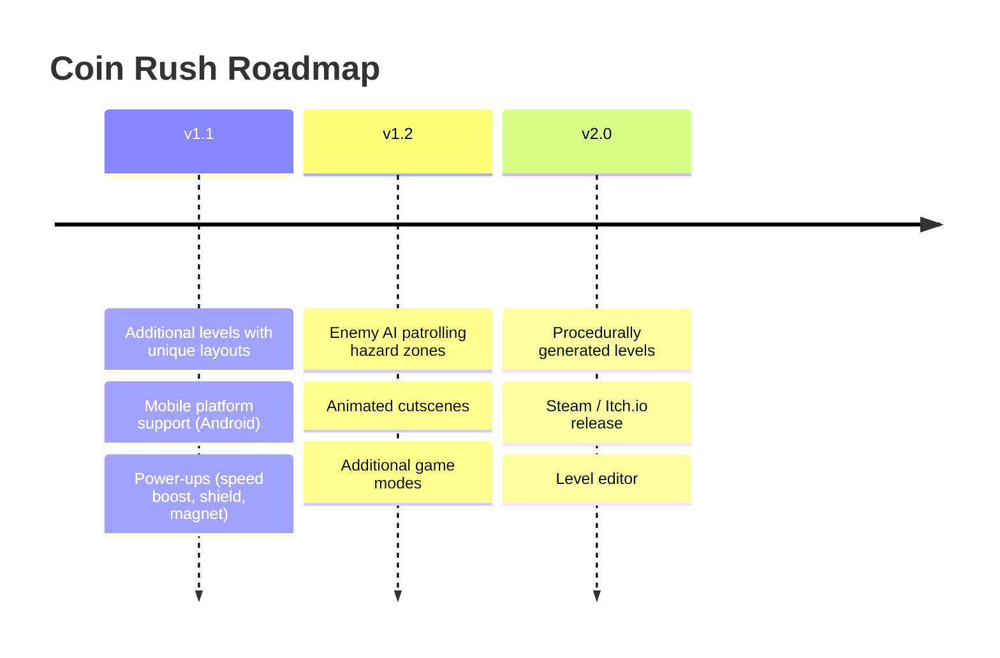
```mermaid
timeline
    title Coin Rush Roadmap
    v1.1 : Additional levels with unique layouts
         : Mobile platform support (Android)
         : Power-ups (speed boost, shield, magnet)
    v1.2 : Enemy AI patrolling hazard zones
         : Animated cutscenes
         : Additional game modes
    v2.0 : Procedurally generated levels
         : Steam / Itch.io release
         : Level editor
```

| Version | Feature | Priority |
|---|---|:---:|
| v1.1 | 🗺️ Additional levels | 🔴 High |
| v1.1 | 📱 Android support | 🔴 High |
| v1.1 | ⚡ Power-ups | 🟡 Medium |
| v1.2 | 🤖 Enemy AI | 🟡 Medium |
| v1.2 | 🎬 Animated cutscenes | 🟡 Medium |
| v2.0 | 🔀 Procedural generation | 🟢 Low |
| v2.0 | 🎮 Steam / Itch.io release | 🟢 Low |
| v2.0 | 🛠️ Level editor | 🟢 Low |

<br/>

---

## 📊 Project Statistics

<div align="center">

| Metric | Value |
|---|---|
| 🎮 **Total Scenes** | 2 |
| 📜 **Total Scripts** | 11 |
| 🔧 **Core Scripts** | 3 |
| 🧍 **Player Scripts** | 4 |
| 🖥️ **UI Scripts** | 3 |
| 🎮 **Gameplay Scripts** | 1 |
| 🪙 **Collectible Coins** | 25 |
| 🔊 **Audio Clips** | 8 |
| 🖥️ **UI Screens / Panels** | 10 |
| ⚙️ **Persistent Settings** | 3 |
| 🏆 **Leaderboard Entries** | Top 5 |
| 💻 **Target Platform** | Windows |
| 📦 **Build Type** | Standalone |

</div>

<br/>

---

## 👨‍💻 Developer

<div align="center">

<table>
<tr>
<td align="center" width="100%">

<br/>

### Suryansh Patel

*Unity Game Developer &nbsp;·&nbsp; C# &nbsp;·&nbsp; Game Project*

[](https://github.com/Suryansh1483)
[](https://www.linkedin.com/in/suryansh-patel-7b32b2324/)

<br/>

</td>
</tr>
</table>

> *"This project was built to demonstrate core Unity game development competencies — from architecture and systems design to UI, audio, and data persistence — as a professional portfolio piece."*
>
> — **Suryansh Patel**

</div>

<br/>

---

## 📄 License

```
MIT License

Copyright (c) 2024 Suryansh Patel

Permission is hereby granted, free of charge, to any person obtaining a copy
of this software and associated documentation files (the "Software"), to deal
in the Software without restriction, including without limitation the rights
to use, copy, modify, merge, publish, distribute, sublicense, and/or sell
copies of the Software, and to permit persons to whom the Software is
furnished to do so, subject to the following conditions:

The above copyright notice and this permission notice shall be included in all
copies or substantial portions of the Software.

THE SOFTWARE IS PROVIDED "AS IS", WITHOUT WARRANTY OF ANY KIND, EXPRESS OR
IMPLIED, INCLUDING BUT NOT LIMITED TO THE WARRANTIES OF MERCHANTABILITY,
FITNESS FOR A PARTICULAR PURPOSE AND NONINFRINGEMENT.
```

<br/>

---

## 🙏 Acknowledgements

| Resource | Credit |
|---|---|
| 🎮 [Unity Technologies](https://unity.com) | Game engine and documentation |
| 📝 [TextMesh Pro](https://docs.unity3d.com/Packages/com.unity.textmeshpro@3.0/manual/index.html) | Advanced UI text rendering |
| 🎵 [Freesound.org](https://freesound.org) | Free audio assets |
| 📷 [Unity Asset Store](https://assetstore.unity.com) | 3D assets and materials |
| 🌐 [GitHub Community](https://github.com) | Open source inspiration |
| 📖 [Unity Learn](https://learn.unity.com) | Tutorials and documentation |

<br/>

---

<div align="center">


**⭐ If you found this project useful or impressive, please star the repository!**

*Built with ❤️ by [Suryansh Patel](https://github.com/Suryansh1483)*

[](https://unity.com)
[](https://docs.microsoft.com/dotnet/csharp/)

</div>
